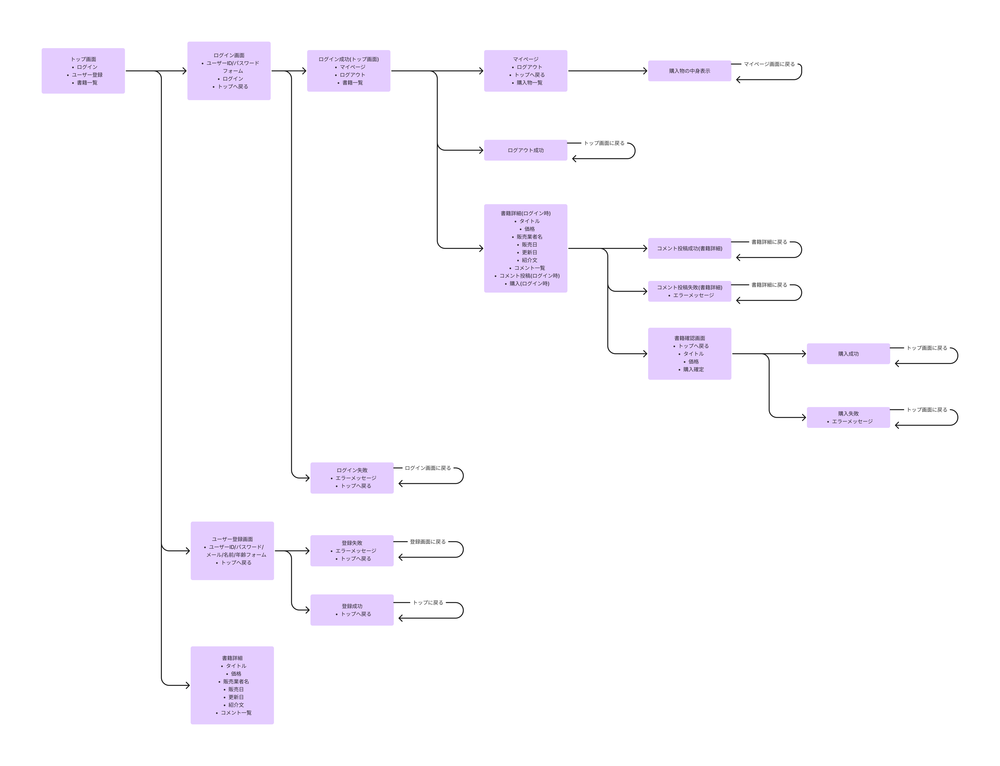
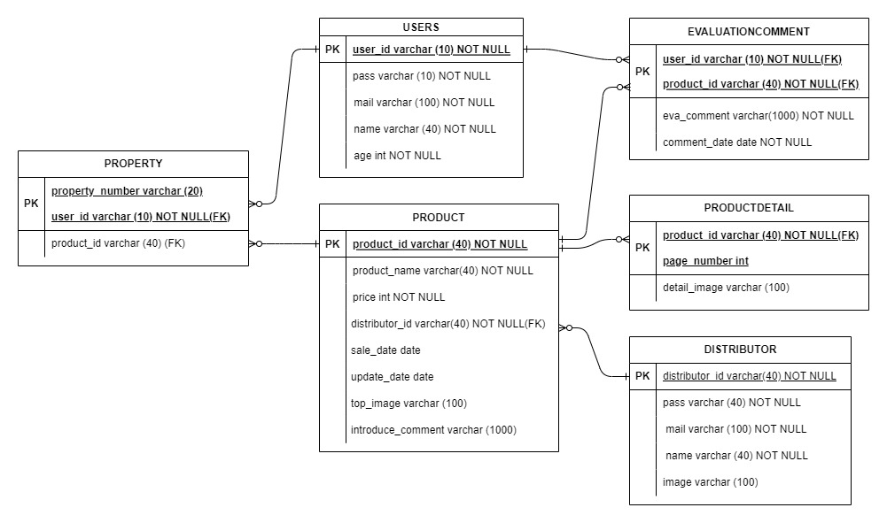

### 開発目的  
3カ月の勉強の確認とCRUD実装できるかの確認。  
フレームワーク学習前にフルスクラッチで開発。  

### 使用技術 ()内はバージョンを示す  

pleiades(2024)  

### URL  

### 画面遷移図  

  

### ER図  

  

### 機能一覧  

1. ログイン機能  
    - アプリケーションにログインする  
    - ユーザーIDとパスワードの入力によりユーザーを認証する  
2. ログアウト機能  
    - アプリケーションからログアウトする  
3. ユーザー登録機能  
    - ユーザーを登録する  
    - 登録する情報は  
        - ユーザーID  
        - パスワード  
        - メールアドレス  
        - 名前  
        - 年齢  
    - 同じユーザーIDは登録できない  
4. 書籍一覧表示機能  
    - 書籍を一覧で表示する  
    - 表示する情報は  
        - タイトル  
        - 価格  
        - イメージ画像  
5. 書籍詳細表示機能  
    - 書籍の詳細を表示する  
    - 表示する情報は  
        - イメージ画像  
        - タイトル  
        - 価格  
        - 販売業者の名前  
        - 販売日  
        - 更新日  
        - コメント  
6. 書籍にコメントする機能  
    - コメントを投稿する機能  
    - 事前にログインしている必要がある  
    - 1つの書籍に1回しか投稿できない  
    - 自分の投稿のみ削除することができる  
7. 書籍購入機能  
    - 書籍を購入する機能  
    - 事前にログインしている必要がある  
    - 購入済みのものは購入できない  
8. 購入物だけ表示する機能  
    - 購入物のみ表示する機能  
    - 事前に購入している必要がある  
9. 書籍を読む機能  
    - 購入した書籍を読む機能  
    - 事前に購入している必要がある  
